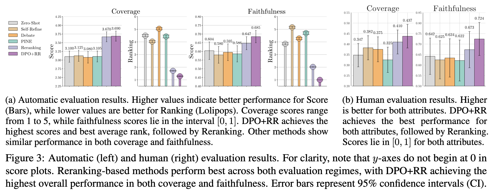

# Reranking-based Generation for Unbiased Perspective Summarization

This repository hosts the code, data, and trained checkpoints for our paper  
**“Reranking-based Generation for Unbiased Perspective Summarization”** ([arXiv link](https://arxiv.org/abs/)).  
We study the task of generating unbiased political perspective summaries by (1) identifying reliable metrics that capture biasedness and assess summary quality, and (2) investigating the efficacy of LLM-based methods beyond zero-shot inference. 
While prior studies suggest that language models exhibit various forms of generation bias, we show that state-of-the-art models can produce fairer summaries through candidate reranking, and that perspective faithfulness improves even further when the models are preference-tuned on reranked examples.

</img>

## Navigation
- [Installation](#installation)
- [Datasets](#datasets)
- [Running Summarization Methods](#running-summarization-methods)
- [Evaluation Metrics](#evaluation-metrics)
- [Bugs & Questions](#bugs--questions)
- [Citation](#citation)

---

## Installation

Please see `requirements.txt` for a full list of requirements.
To install, run
```bash
pip install -r requirements.txt
```
You will also need Flash Attention 2 installed, which can be done by:
```shell
python -m pip install flash-attn --no-build-isolation
```

## Training and Human Annotation Data

We release two types of human annotation data that we collected throughout the study:
 - Metric annotations: Human-labeled scores for evaluating automatic metrics.
→ Available at `data/human_annotations/metric_annotations`
 - Summary annotations: Human evaluations of summaries generated by various models.
→ Available at `data/human_annotations/summary_annotations`

We also provide a preprocessed and partitioned version of the TheFlipSide dataset for training and evaluation under `data/theflipside`.

## Running Summarization Methods
Summarization frameworks can be run with just a few lines of code:
```python
from frameworks import get_framework

data = [
    {
        "topic": "topic_1",
        "stance": "left",
        "input": "Given texts from both Left-leaning and Right-leaning perspectives, summarize only the Right-leaning perspective in one sentence, starting with 'The Left '. ONLY RETURN THE SUMMARY AND NOTHING ELSE.
        
        Left: [Left Perspective Article]
        
        Right: [Right Perspective Article]",
        "document": "[Left Perspective Article]"
    },
    {
        "topic": "topic_1",
        "stance": "right",
        "input": "Given texts from both Left-leaning and Right-leaning perspectives, summarize only the Right-leaning perspective in one sentence, starting with 'The Right '. ONLY RETURN THE SUMMARY AND NOTHING ELSE.
        
        Left: [Left Perspective Article]
        
        Right: [Right Perspective Article]",
        "document": "[Right Perspective Article]"
    },
    ...
]

method = get_framework("dpo", ".configs/frameworks/dpo_trained.yaml")
method.infer_batch(data, "dpo.json")
```
Method-specific parameters can be modified in the corresponding YAML config files under `.configs/`. 
See `frameworks/` for a full list of supported methods.
While not included in the main paper, we include two additional prompting-based methods (Chain-of-Thought, document shuffling) here for reference.

## Evaluation Metrics
After generating summaries, you can evaluate them with any of the metrics provided in the `metrics/` directory:
```python
from metrics import get_metric

document = "[SOURCE ARTICLE]"
summary = "[GENERATED SUMMARY]"

metric = get_metric("unieval")
score = metric.score(document, summary)
```
See `metrics/` for all supported metrics.

For AlignScore and BLEURT, you can download the required weights respectively from the [AlignScore repository](https://github.com/yuh-zha/AlignScore) and [BLEURT-20-D6](https://huggingface.co/lucadiliello/BLEURT-20-D6).
Ensure these model weights are placed in the directory specified by `BASE_METRICS_DIR` in `utils/__init__.py`.

## Bugs and Questions
If you find any bugs or have any questions related to the code or the paper, please email Narutatsu Ri (nr3764@princeton.edu). If you encounter any problems, please feel free to open an issue.

## Citation
Please cite our paper if you find this repository to be helpful in your work as follows:
```bibtex
@article{ri2025reranking,
  title={Reranking-based Generation for Unbiased Perspective Summarization},
  author={Ri, Narutatsu and Deas, Nicholas and McKeown, Kathleen},
  journal={arXiv preprint arXiv:},
  year={2025}
}
```